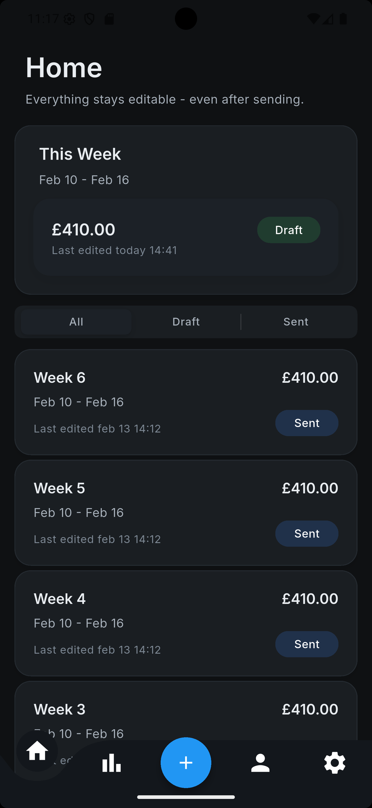
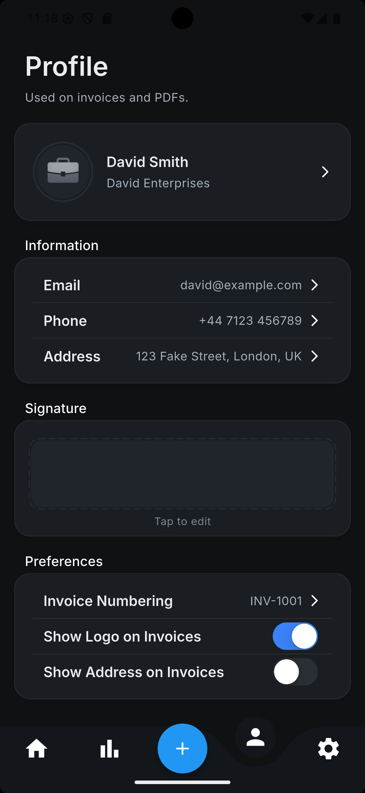
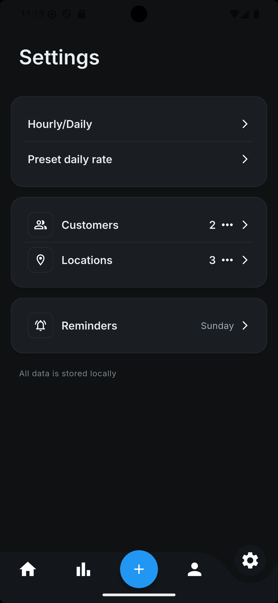
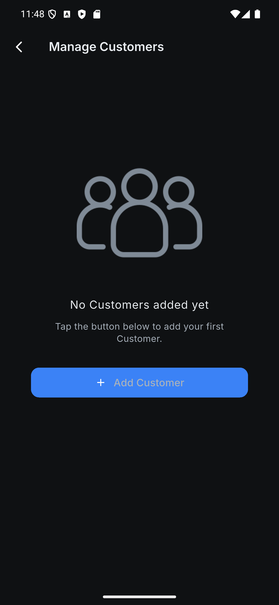
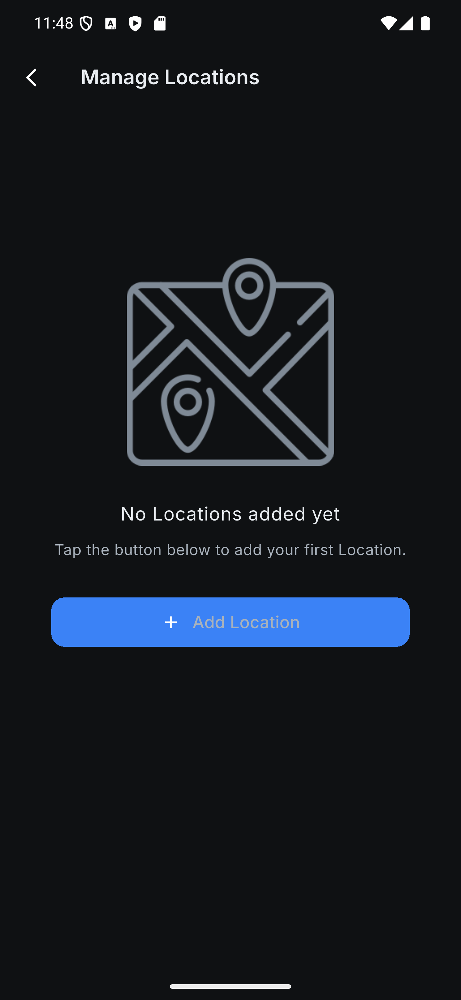

# Clocked Pay - Flutter App Project

Clocked Pay is a dark-mode invoicing app built for self-employed workers who invoice weekly.

I originally built this after being asked to create something simple for someone who just needed to track days worked and send clean weekly invoices — without signing up to a big accounting platform.

## Features

Track hours or days (Monday–Sunday)

• Set a rate

• Manage customers and locations

• Generate a professional PDF invoice

• Keep everything editable

That’s it.

There’s no cloud sync, no accounts, and no unnecessary features. All data is stored locally on the device. The idea was to make something calm, fast, and trustworthy — especially since it deals with real money.

The UI is dark-mode first and intentionally minimal. I avoided clutter and tried to keep the experience straightforward: open the app, log your work, generate the invoice, send it.

It’s built with Flutter, uses a custom design system (no UI kits), and is structured to be scalable for future additions like tax handling and deeper analytics.

This isn’t an accounting suite — it’s a focused tool for people who just need to get paid properly each week.

## Screenshots

   
  <strong>Home Screen</strong>

   
  <strong>Profile Screen</strong>

   
  <strong>Settings Screen</strong>

   
  <strong>Customer Dialogue</strong>

   
  <strong>Location Dialogue</strong>

